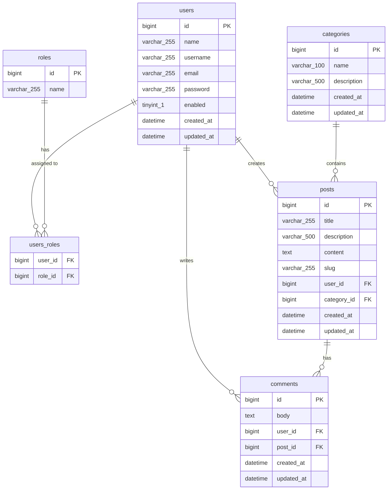

# PostPulse Backend

      

A RESTful editorial API built with **Java 21 and Spring Boot 3**, designed to demonstrate backend engineering fundamentals in a real-world context — secure authentication, layered architecture, database migration management, comprehensive unit and integration testing, and a fully containerized CI/CD pipeline.

The API enforces a **three-tier editorial access model**:

- **Admin (`ADMIN` role)** — Full control: create, update, and delete any post, category, or comment.
- **User (`USER` role)** — Limited to comments: create comments on any post, and update or delete only their own comments. Cannot manage posts or categories.
- **Public (unauthenticated)** — Read-only: view all posts, categories, and comments. Cannot perform any write operation.

---

## Tech Stack

| Layer         | Technology                                                    |
|---------------|---------------------------------------------------------------|
| Language      | Java 21                                                       |
| Framework     | Spring Boot 3, Spring Security, Spring Data JPA               |
| Database      | MySQL 8.0                                                     |
| Migrations    | Flyway                                                        |
| Auth          | JWT (jjwt 0.13, signature verification via parseSignedClaims) |
| Mapping       | ModelMapper                                                   |
| Documentation | Swagger UI / OpenAPI 3.0                                      |
| Testing       | JUnit 5, Mockito, H2 (in-memory), JaCoCo                      |
| DevOps        | Docker, Docker Compose, GitHub Actions                        |

---

## Key Features

- **JWT Authentication** — Stateless token-based auth with signature verification; role-based access control (`ADMIN` / `USER`)
- **Strict editorial access model** — Admins publish and manage content, users comment, public reads. No cross-role write operations permitted.
- **Role-Based Access Matrix**:

  | Operation                        | Admin | User         | Public |
    |----------------------------------|-------|--------------|--------|
  | View posts, categories, comments | ✅     | ✅            | ✅      |
  | Create post / category           | ✅     | ❌            | ❌      |
  | Update post / category           | ✅     | ❌            | ❌      |
  | Delete post / category           | ✅     | ❌            | ❌      |
  | Create comment                   | ✅     | ✅            | ❌      |
  | Update own comment               | ✅     | ✅ (own only) | ❌      |
  | Delete own comment               | ✅     | ✅ (own only) | ❌      |
  | Update / delete any comment      | ✅     | ❌            | ❌      |

- **Slug-based Post URLs** — Auto-generated unique slugs on post creation; regenerated on title change; accessible via `GET /posts/slug/{slug}`
- **Flyway Migrations** — All schema changes are versioned SQL files; the database builds itself on first startup
- **Programmatic Dev Data Seeder** — `DemoDataSeeder` seeds users, categories, posts, and comments on startup under the `dev` profile; guarded by `app.seed-data.enabled` flag; skips if data already exists
- **Pagination & Sorting** — Configurable page number, page size, sort field, and sort direction on all list endpoints; list responses return `PostPageResponse` (summary projection, no body)
- **Keyword Search** — Search across article content via query parameter
- **Input Validation** — Request payloads validated with Jakarta Bean Validation (`@NotBlank`, `@NotNull`, `@Size`, `@Positive`) on all request DTOs and path variables
- **Strict DTO Separation** — Domain-organized request/response DTOs enforce API boundaries; internal entity structure never exposed
- **Global Exception Handling** — RFC 7807 `ProblemDetail` responses across all endpoints; ISO 8601 timestamps, field-level validation errors, and type URIs linking to `docs/Errors.md`
- **Ownership Enforcement** — Comment update/delete validates that the requesting user owns the comment; Admin can bypass ownership checks; logic centralized in the service layer
- **Structured Logging** — SLF4J `log.info` at all create/update/delete boundaries; `log.debug` on token generation/validation; `log.warn` on all JWT exception branches
- **Swagger UI** — Interactive API documentation at `/swagger-ui/index.html`; reusable `@CommonApiResponses` annotation documents standard error shapes on all endpoints
- **Dockerized** — Single `docker-compose up` starts the entire stack; MySQL healthcheck prevents app startup race

---

## Architecture

```text
Request → JwtAuthenticationFilter → Controller → Service → Repository → MySQL
                ↑
         SecurityConfig (role-based endpoint protection)
```

- **Strict layered separation** — Controller → Service → Repository, no layer bypasses; constructor injection enforced throughout
- **DTO / Payload pattern** — The API never exposes internal entity structure directly; all I/O goes through domain-organized request/response DTOs (`auth/`, `category/`, `comment/`, `post/` subpackages)
- **SecurityUtils** — Current user resolution (`userId`, `User`, authorities) and ADMIN bypass logic centralized here; `SecurityContextHolder` never accessed directly in service implementations
- **SlugUtils** — Unique URL slug generation with collision counter loop; called by `PostService` on create and on title change
- **Flyway-first schema management** — Hibernate is set to `validate` only; Flyway owns all DDL; entity-to-table mismatch fails fast at startup
- **Profile-based configuration** — `dev` profile for local development with seeder and fallback credentials; `prod` profile for Docker deployment; `test` profile for CI/CD with H2 isolation
- **JpaAuditingConfig** — `@EnableJpaAuditing` extracted to a dedicated `@Configuration` class; prevents JPA metamodel initialization errors in `@WebMvcTest` and `@DataJpaTest` slices

---

## Testing & Code Quality

- **Test Infrastructure**: `BaseRepositoryTest` centralizes `@DataJpaTest + @ActiveProfiles("test") + @Import(JpaAuditingConfig)`; `BaseControllerTest` centralizes `@Import(SecurityConfig, JwtAuthenticationFilter, JwtAuthenticationEntryPoint)` — all test classes extend the appropriate base, eliminating annotation duplication
- **Security Layer Tests**: `JwtTokenProviderTest` covers token generation, username extraction, and all four exception branches (malformed, expired, wrong signature, blank token); `JwtAuthenticationFilterTest` verifies SecurityContext population on valid token, skip behavior on invalid/absent tokens, and `filterChain.doFilter()` always called; `CustomUserDetailsTest` and `CustomUserDetailsServiceTest` cover all user detail contracts including dual-lookup and roles mapping
- **Controller Slice Tests** (`@WebMvcTest` + `BaseControllerTest`): `AuthControllerTest`, `CategoryControllerTest`, `PostControllerTest`, and `CommentControllerTest` cover happy paths, role-based 401/403 enforcement, validation 400s, ownership FORBIDDEN cases, and service-never-called guards on validation failure
- **Service Layer Tests**: All service implementations tested with JUnit 5 and Mockito; `ArgumentCaptor` verifies that all required fields are set on entities before `save()` is called; ownership paths (Owner success, Admin bypass, NonOwner FORBIDDEN) covered for Comment update and delete
- **Repository Layer Tests**: Custom query methods tested against H2 with real data fixtures — uniqueness guards (`existsByName`, `existsBySlug`), self-exclusion (`existsByNameAndIdNot`, `existsBySlugAndIdNot`), JOIN FETCH contracts (user fields asserted non-null and populated — not lazy proxy), and `@Modifying` JPQL delete (row count verified)
- **ModelMapper Tests**: `TestModelMapper` singleton mirrors production `ModelMapperConfig`; `Post→PostResponse` and `Post→PostSummary` PropertyMaps tested field-by-field including nested associations and null-relation guard behavior
- **Test Profile Isolation**: `application-test.properties` activates only under `@ActiveProfiles("test")`; does not override production config during `@SpringBootTest` runs
- **JaCoCo Gate**: Seeder package excluded from coverage measurement (dev-only fixtures); 75%+ gate enforced on production-relevant code
- **Test Naming**: Test names document behavior — e.g., `createPost_ValidRequest_Returns201_AndCallsServiceWithCorrectDto()` reads as a specification

---

## Database Migrations

Schema is managed entirely by Flyway. On startup, Flyway runs any pending migrations in order before the application accepts traffic.

```text
resources/db/migration/
├── V1__Initial_Schema.sql                      — creates all tables, seeds ROLE_ADMIN and ROLE_USER
├── V2__Categories_and_Posts.sql                — seeds demo categories and posts
└── V3__Comments_and_Final_Constraints.sql      — seeds demo comments and enforces final constraints
```

Hibernate is configured with `ddl-auto=validate` — it verifies entity-to-table mapping at startup but never touches the schema itself.

---

## Getting Started

### Prerequisites

- Docker and Docker Compose, **or**
- Java 21 and MySQL 8.0 running locally

---

### Option 1: Docker (Recommended)

```bash
git clone https://github.com/AbhishekSharma-99/PostPulse-Backend.git
cd PostPulse-Backend

cp .env.example .env
# Edit .env with your values (see Environment Variables section below)

docker-compose up -d
```

The API starts at `http://localhost:8080`. Flyway runs migrations automatically — the database is fully seeded on first startup. The MySQL healthcheck in `docker-compose.yml` ensures the app container waits for MySQL to be fully ready before starting.

---

### Option 2: Local Development

1. Ensure MySQL 8.0 is running and create a database named `postpulse`
2. Copy `.env.example` to `.env` and fill in your local credentials
3. Update `SPRING_DATASOURCE_URL` to use `localhost` instead of `mysql`

```bash
mvn clean install
mvn spring-boot:run -Dspring-boot.run.profiles=dev
```

The `dev` profile activates the `DemoDataSeeder`, which seeds users, categories, posts, and comments on first startup (skips if data already exists).

---

## Environment Variables

Copy `.env.example` to `.env` and fill in your values. Never commit `.env` — it is already in `.gitignore`.

```env
# MySQL container configuration (used by Docker Compose)
MYSQL_ROOT_PASSWORD=your_root_password
MYSQL_DATABASE=postpulse
MYSQL_USER=your_db_user
MYSQL_PASSWORD=your_db_password

# Spring Boot datasource
SPRING_DATASOURCE_URL=jdbc:mysql://mysql:3306/postpulse
SPRING_DATASOURCE_USERNAME=your_db_user
SPRING_DATASOURCE_PASSWORD=your_db_password

# JWT
JWT_SECRET_KEY=your_minimum_32_character_secret_key_here
JWT_EXPIRATION_MILLISECONDS=604800000
```

> `SPRING_DATASOURCE_URL` uses `mysql` as the hostname — this is the Docker Compose service name. For local development without Docker, change it to `localhost`.

> Fallback defaults exist in `application.properties` and `application-dev.properties` so the app starts without a `.env` file in local development. In production, these are overridden by real secrets supplied through environment variables in the CI pipeline.

---

## Demo Credentials

The `DemoDataSeeder` (activated under the `dev` profile) seeds the following accounts. All share the same password.

| Username       | Email                    | Role         | Password       | Permissions                                            |
|----------------|--------------------------|--------------|----------------|--------------------------------------------------------|
| `abhishek_dev` | `abhishek@postpulse.com` | ADMIN + USER | `Password@123` | Full control — manage posts, categories, and comments  |
| `priya_writes` | `priya@postpulse.com`    | USER         | `Password@123` | Comment only — create, update, and delete own comments |
| `rohan_tech`   | `rohan@postpulse.com`    | USER         | `Password@123` | Comment only — create, update, and delete own comments |

Use the `/api/v1/auth/login` endpoint to obtain a JWT, then click **Authorize** in Swagger UI and paste the token.

> `priya_writes` and `rohan_tech` hold the `USER` role and are restricted to commenting. Attempts to create, update, or delete posts or categories will return `403 Forbidden`. Only `abhishek_dev` (ADMIN) can manage editorial content.

---

## API Documentation

Interactive Swagger UI is available at:

```
http://localhost:8080/swagger-ui/index.html
```

All endpoints are annotated with `@CommonApiResponses`, which documents standard 400, 401, 403, 404, and 500 error shapes in the OpenAPI spec. Error response bodies follow RFC 7807 `ProblemDetail` format with `type` URIs that dereference to `docs/Errors.md`.

### Key Endpoints

| Feature                   | Method   | Endpoint                                                   | Access Required               |
|---------------------------|----------|------------------------------------------------------------|-------------------------------|
| Register                  | `POST`   | `/api/v1/auth/register`                                    | Public                        |
| Login                     | `POST`   | `/api/v1/auth/login`                                       | Public                        |
| Get all posts (paginated) | `GET`    | `/api/v1/posts?pageNo=0&pageSize=10&sortBy=id&sortDir=asc` | Public                        |
| Get post by ID            | `GET`    | `/api/v1/posts/{id}`                                       | Public                        |
| Get post by slug          | `GET`    | `/api/v1/posts/slug/{slug}`                                | Public                        |
| Create post               | `POST`   | `/api/v1/posts`                                            | **ADMIN**                     |
| Update post               | `PUT`    | `/api/v1/posts/{id}`                                       | **ADMIN**                     |
| Delete post               | `DELETE` | `/api/v1/posts/{id}`                                       | **ADMIN**                     |
| Get posts by category     | `GET`    | `/api/v1/posts/category/{categoryId}`                      | Public                        |
| Search posts              | `GET`    | `/api/v1/posts/search?query=spring`                        | Public                        |
| Get all categories        | `GET`    | `/api/v1/categories`                                       | Public                        |
| Get category by ID        | `GET`    | `/api/v1/categories/{id}`                                  | Public                        |
| Create category           | `POST`   | `/api/v1/categories`                                       | **ADMIN**                     |
| Update category           | `PUT`    | `/api/v1/categories/{id}`                                  | **ADMIN**                     |
| Delete category           | `DELETE` | `/api/v1/categories/{id}`                                  | **ADMIN**                     |
| Get comments for post     | `GET`    | `/api/v1/posts/{postId}/comments`                          | Public                        |
| Add comment to post       | `POST`   | `/api/v1/posts/{postId}/comments`                          | Authenticated (USER or ADMIN) |
| Update comment            | `PUT`    | `/api/v1/posts/{postId}/comments/{commentId}`              | Owner or ADMIN                |
| Delete comment            | `DELETE` | `/api/v1/posts/{postId}/comments/{commentId}`              | Owner or ADMIN                |

> All `GET` endpoints are publicly accessible — no authentication required. All `POST`, `PUT`, and `DELETE` operations on `/posts` and `/categories` are restricted to `ADMIN`. Comment write operations require authentication; update and delete additionally enforce ownership in the service layer, with ADMIN able to bypass the ownership check.

---

## CI/CD Pipeline

Every push to `main` triggers the GitHub Actions pipeline:

```text
Push to main
     │
     ▼
Build & Test (Maven + JDK 21)
     │── Runs all JUnit tests against H2 in-memory DB (test profile)
     │── Generates JaCoCo coverage report
     │── Enforces 75%+ coverage gate (seeder package excluded)
     │── Uploads report as build artifact
     │
     ▼ (on success)
Docker Build & Push
     │── Builds image from Dockerfile
     │── Pushes two tags to Docker Hub:
     │       :latest
     │       :<git-sha>  (for full traceability)
     └── Uses GitHub Actions layer caching for faster builds
```

---

## Project Structure

```text
src/main/java/com/postpulse/
├── config/         — SecurityConfig, ModelMapperConfig, OpenApiConfig, JpaAuditingConfig
├── controller/     — REST controllers (Auth, Category, Post, Comment)
├── service/        — interfaces + impl/ subpackage (@Transactional on writes)
├── repository/     — Spring Data JPA + custom JOIN FETCH queries
├── entity/         — JPA entities extending BaseEntity
├── payload/        — DTOs by domain (auth/, category/, comment/, post/)
├── security/       — JWT filter chain, token provider, entry point
├── exception/      — GlobalExceptionHandler (RFC 7807), custom exceptions
├── seeder/         — DemoDataSeeder + sub-seeders (dev profile only)
└── utils/          — AppConstants, SecurityUtils, SlugUtils
```

---

## Security Highlights

- **JWT Signature Verification**: Tokens validated with `parseSignedClaims()` — unsigned and tampered tokens rejected; `SignatureException` explicitly caught and logged
- **CustomUserDetails**: Wraps `User` entity; exposes `userId`, `name`, `email`, and typed authority getters; `isEnabled()` reflects `User.enabled` field
- **JwtAuthenticationEntryPoint**: Delegates to `HandlerExceptionResolver` for consistent RFC 7807 `ProblemDetail` 401 responses (no `response.sendError()` bypass)
- **Constructor Injection**: All Spring dependencies injected via constructors; `@Autowired` field injection eliminated
- **Authorization Scoping**:
    - **Public (no token required):** all `GET` endpoints under `/api/v1/posts/**`, `/api/v1/categories/**`, and `/api/v1/posts/{postId}/comments`
    - **ADMIN role required:** `POST`, `PUT`, `DELETE` on `/api/v1/posts/**` and `/api/v1/categories/**`
    - **Authenticated (any role):** `POST /api/v1/posts/{postId}/comments`
    - **Owner or ADMIN:** `PUT` and `DELETE` on `/api/v1/posts/{postId}/comments/{commentId}` — ownership checked via `validateCommentBelongsToUser`; ADMIN bypasses the ownership check
- **Input Validation**: All request DTOs and path variables enforce `@NotBlank`, `@NotNull`, `@Size`, `@Positive`; validation failures return 400 `ProblemDetail` with field-level errors before reaching service layer
- **Exception Handling**: Correct HTTP semantics — 401 Unauthorized (unauthenticated), 403 Forbidden (authenticated but not authorized), 404 Not Found, 409 Conflict (duplicate name/slug), 500 Internal Server Error with safe message (no stack trace exposure)

---

## Database Schema



---

## Maintained by [Abhishek Sharma](https://github.com/AbhishekSharma-99)